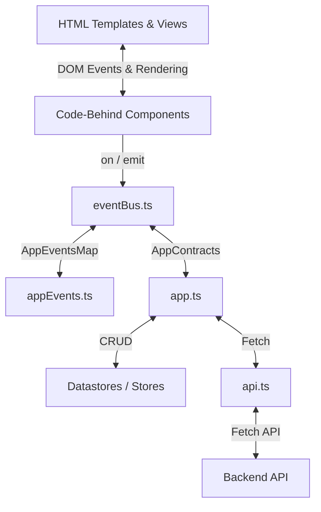

# Frontend Architecture Guide

This document defines the architectural patterns, rules, restrictions, and layout mechanics used throughout the Finalysis application. Use this as context to align development practices when working with this codebase.
---
## 1. Core Architecture Files
The frontend follows a clean separation of concerns dividing application coordination, communication, data querying, event definition, and rendering.

### 1. `app.ts` (Application Orchestrator)
*   **Key Functions**: Acts as the central controller and wiring layer of the application. It subscribes to high-level events on the `eventBus`, coordinates fetches via `api.ts`, executes CRUD operations on datastores, and dynamically mounts/unmounts visual components.
*   **Restrictions**:
    *   Must remain completely agnostic of visual rendering. Never perform direct DOM manipulation, query selectors, or inline CSS modifications.
    *   No direct styling logic. All rendering decisions must be delegated to components.
### 2. `api.ts` (API Client Wrapper)
*   **Key Functions**: Exports stateless asynchronous functions (e.g., `fetchFundamentals`, `fetchMarketData`, `fetchFilingsData`) that query the backend server endpoints.
*   **Restrictions**:
    *   Cannot access or write to datastores/stores.
    *   Cannot interact with or reference view components or the DOM.
    *   Must be stateless, receiving request contracts and returning strictly typed response contracts.
### 3. `appEvents.ts` (Event Definition)
*   **Key Functions**: The type definition file that maps every single event name string to its corresponding payload contract (e.g., `AppEventsMap` composition).
*   **Restrictions**:
    *   Strictly a design-time TypeScript definition file. Must contain **zero runtime JavaScript code**.
### 4. `eventBus.ts` (Typed Event Hub)
*   **Key Functions**: A lightweight, generic-bounded pub-sub system (`on`/`emit`) that enables decoupled communication between components. It broadcasts activity automatically to a logger listener (`System:EventBus:Activity`).
*   **Restrictions**:
    *   Does not maintain application state or store data.
    *   Cannot contain domain-specific business logic.
### 5. `component.ts` (Base View Component)
*   **Key Functions**: The abstract base class that every UI component extends. It manages:
    *   Dynamic HTML template loading via `fetch`.
    *   Caching elements containing an `id` attribute into a local `Map<string, HTMLElement>` to prevent repetitive query selector calls.
    *   Mounting templates to target container IDs.
    *   Unmounting elements while automatically executing registered event unsubscriptions.
*   **Restrictions**:
    *   Must be completely independent and store-agnostic.
    *   Cannot query or mutate elements outside its own container boundaries.
    *   Must clean up all event bindings on unmount to prevent memory leaks.
---
## 2. Declarative & Programmatic UI (Code-Behind Pattern)
UI elements are built using a clean "Code-Behind" pattern, splitting markup structure from presentation logic.
### Declarative Template (HTML)
*   Defined in separate `.html` files in the component directory (e.g., `peer-chart-viewer.html`).
*   Declares structural elements, CSS classes, and layout boxes.
*   **No inline JavaScript** or logic is allowed inside the templates.
*   Interactive and dynamic elements are designated with unique, descriptive `id` attributes.
### Programmatic Code-Behind (TypeScript)
*   A TypeScript class extending `Component` (e.g., `class PeerCharts extends Component`).
*   In the constructor, it points to the target container ID and the template HTML file path.
*   Implements `bindEvents()` to listen to DOM events or `eventBus` events.
*   Utilizes `this.getElement<T>('id-name')` to query cached elements, ensuring high-performance access.
*   Performs DOM-specific rendering updates (like table generation or Chart.js drawing) inside the component's boundaries.
---
## 3. Strict Event Typing & Contract Enforcement
To prevent loose, free-form, or brittle strings from breaking the event-driven system, events and data payloads are compile-time verified:
### Type-Safe Event Bus
The `eventBus.ts` uses TypeScript generics tied to `AppEventsMap` in `appEvents.ts`:
```typescript
class EventBus {
    on<K extends keyof AppEventsMap>(eventName: K, callback: (data: AppEventsMap[K]) => void): () => void;
    emit<K extends keyof AppEventsMap>(eventName: K, data: AppEventsMap[K]): void;
}
```
*   **Compile-Time Validation**: Specifying an event name that is not a key of `AppEventsMap` causes a TypeScript compilation error.
*   **Strict Payloads**: Emitting or listening to an event requires a payload matching the exact interface defined in the map, preventing runtime data misalignment.
### Contract Enforcement (`appContracts.ts`)
*   Data transfer objects (DTOs) for requests, API responses, datastores, and view models are explicitly modeled.
*   Examples: `FundamentalsRequestContract`, `FundamentalsResponseContract`, `FundamentalsViewContract`.
*   Adapters (e.g., `fundamentalsAdapter.ts`) transform raw backend responses into view-ready contracts immediately before cache insertion, keeping components clean and safe from shape changes.
---
## 4. Steel-Frame CSS Layout System
The styling architecture uses a strict separation between **structure** (handled by `steel-frame.css`) and **visual skinning** (delegated to Bootstrap themes like Darkly, Lux, or united).
### The Basic Tenet of Steel-Frame
1.  **Container Contains**: The viewport and all main grid cells/regions are structurally constrained. They are set to `overflow: hidden`.
2.  **Overflow is Clipped**: Containers do not allow content to spill out or trigger parent-level window scrollbars.
3.  **Contained Element Expands**: Child elements grow to fill the container's available height/width using flexbox wrappers (`.app-col`, `.app-row`, `.flex-1`).
4.  **Contained Element Manages Scrolling**: Scrolling is isolated to specific, leaf-level content panes (like table bodies or chart canvases) using `overflow: auto` or `overflow-y: auto`.
This guarantees a persistent desktop-app-like structure: headers, search panels, and sidebars remain locked in place while only data grids and text regions scroll.
### Structural Grid & Panel Anatomy
*   **`.grid`**: Configures the main layout columns and rows using CSS Grid, establishing fixed zones (`header`, `left`, `main`, `right`, `footer`) and clipping default overflows.
*   **`.panel`**: A three-row layout grid (`panel-header`, `panel-content`, `panel-footer`).
    *   `.panel-header`: Fixes headers at the top, displaying icons, titles, and action controls.
    *   `.panel-content`: The designated scroll container (`overflow: auto`) that expands to occupy all remaining vertical space.
*   **`.collapsed` & `.collapsed-vertical`**: Structural classes that drop widths/heights to minimal widths (e.g., `33px`) and hide content elements, leaving only the trigger handle visible.
### Restricting CSS Class Soup
To maintain HTML readability and prevent class clutter in templates:
1.  **Semantic Layout Styling**: Core layout structures should rely on dedicated structural selectors (like `.panel`, `.app-col`) instead of chaining dozens of utility helper classes.
2.  **Strict Utility Limit**: Chaining utility classes in declarative HTML must be limited to **at most 3 or 4 classes** per element (e.g., `<div class="d-flex align-items-center mb-2">`). If complex styling or layout overrides are required, define them in a custom stylesheet.