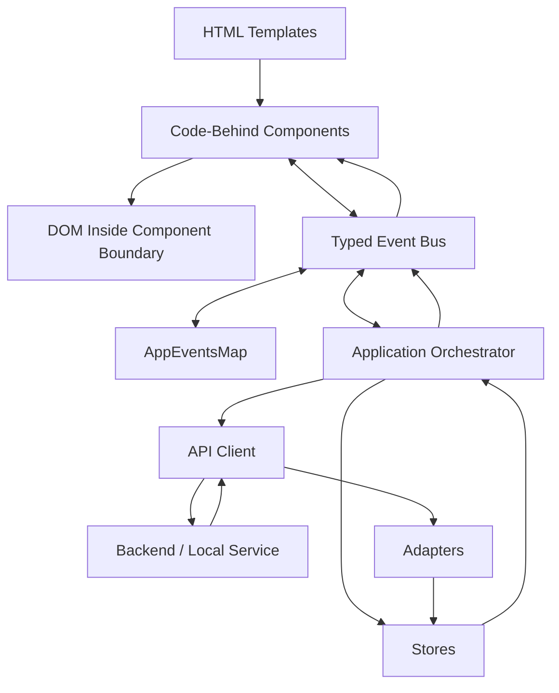

# Steel Frame Workbench Framework

A disciplined TypeScript application architecture for building large, inspectable, local-first web and desktop-style applications without defaulting to React or a heavyweight frontend framework.

This framework is extracted from the development style used in Finalysis and applies directly to Kailua: a lightweight robotic arm, not an autonomous agent.

---

## Core Thesis

You do not need React to build a large application if you replace React’s implicit discipline with explicit discipline of your own.

The browser already provides the essential primitives:

* HTML for structure
* CSS Grid and Flexbox for layout
* TypeScript for contracts and behavior
* DOM events for local interaction
* Fetch for I/O
* Classes or modules for lifecycle boundaries
* Maps, stores, SQLite, or local files for state

A framework is still needed, but it does not have to be a dependency.

The rule is:

> Do not build a pile of scripts. Build a small application frame.

---

## Main Rule

> HTML declares structure.
> CSS owns layout.
> TypeScript owns behavior.
> Contracts own shape.
> Stores own durable client state.
> The event bus owns communication.
> No layer does another layer’s job.

This is the discipline that replaces framework sprawl.

---

## What This Framework Is

The Steel Frame Workbench Framework is not a visual component library, a reactive runtime, or an agent framework.

It is a disciplined structure for building applications where the human remains able to understand, inspect, and modify the system without surrendering control to framework magic.

It is built around five ideas:

1. **Steel Frame layout**: CSS owns layout through a small set of structural primitives.
2. **Code-behind components**: HTML templates declare structure; TypeScript components own behavior.
3. **Typed events**: communication is explicit, named, and compile-time checked.
4. **Contracts and adapters**: data shape is normalized before it reaches views.
5. **Bounded orchestration**: the app coordinates workflows, but no layer becomes a god object.

---

## Architecture Overview



The system is intentionally boring.

A user action emits an event.
The app receives the event.
The app fetches or retrieves data.
Adapters normalize data.
Stores cache data.
The app emits view-ready events.
Components render inside their own boundaries.

No magic loop is required.

---

## Standard Folder Structure

```text
project-root/
  index.html
  package.json
  tsconfig.json
  vite.config.ts

  public/
    components/
      toolbar.html
      example-viewer.html

    css/
      core/
        steel-frame.css

  src/
    adapters/
      exampleAdapter.ts

    components/
      toolbar.ts
      example-viewer.ts

    contracts/
      appContracts.ts

    core/
      api.ts
      app.ts
      component.ts
      eventBus.ts
      store.ts
      helper.ts

    datastores/
      example-store.ts

    events/
      appEvents.ts
```

This structure is part of the framework. Do not reorganize it casually.

---

## Layer Responsibilities

### `app.ts`

The application orchestrator.

Allowed:

* Mount components
* Subscribe to high-level application events
* Coordinate fetches
* Coordinate stores
* Call adapters
* Emit view-ready events
* Manage workflow sequencing

Forbidden:

* Direct DOM rendering
* Inline style manipulation
* Querying component internals
* Business logic that belongs in adapters or services
* Long feature-specific code that should live in a feature module

`app.ts` is a conductor, not a renderer and not a dumping ground.

---

### `api.ts`

The API boundary.

Allowed:

* Export stateless async functions
* Build endpoint URLs
* Perform `fetch`
* Validate HTTP success or failure
* Return typed response contracts

Forbidden:

* DOM access
* Store writes
* Component imports
* Event bus imports
* View-model shaping
* Persistent state

The API client fetches data. It does not decide what the application means.

---

### `appEvents.ts`

The event contract map.

Allowed:

* Type imports
* Event-name-to-payload mappings
* Grouped event-map type composition

Forbidden:

* Runtime code
* Functions
* Side effects
* Data fetching
* DOM access

This file exists so event names and payloads cannot drift silently.

---

### `eventBus.ts`

The typed event hub.

Allowed:

* `on(eventName, callback)`
* `emit(eventName, payload)`
* Return unsubscribe handles
* Optionally broadcast system activity for logging

Forbidden:

* Domain-specific logic
* Store ownership
* API calls
* Rendering
* Retry workflows
* Hidden queues

The event bus is a wire, not a brain.

---

### `component.ts`

The base view component.

Allowed:

* Load an external HTML template
* Mount into a declared container
* Cache elements inside the component boundary
* Provide `getElement<T>()`
* Register event handlers
* Track unsubscribe handles
* Clean up on unmount

Forbidden:

* Accessing elements outside its container
* Owning global app state
* Fetching domain data directly
* Mutating stores directly
* Leaving event subscriptions alive after unmount

A component owns its DOM island and nothing else.

---

### `appContracts.ts`

The shape registry.

Allowed:

* Request contracts
* Response contracts
* View contracts
* Store key types
* Domain enums
* Stable display metadata

Forbidden:

* Fetching
* Rendering
* Event subscriptions
* Store mutations
* Runtime orchestration

Contracts are the source of truth for shape.

---

### `adapters/`

The translation layer.

Allowed:

* Convert raw backend responses into view-ready contracts
* Normalize labels, categories, ordering, and formats
* Shield components from backend shape changes

Forbidden:

* DOM access
* Event bus ownership
* Fetching
* Long-term state

Adapters are where raw data becomes usable application data.

---

### `datastores/`

Client-side durable working memory.

Allowed:

* Hold typed data in Maps or simple structures
* Use deterministic keys
* Enforce cache limits
* Provide explicit getters, setters, deletes, and clears

Forbidden:

* DOM access
* Fetching
* Rendering
* Business workflow orchestration

Stores remember. They do not perform.

---

## Component Pattern

Every visual component has two files:

```text
public/components/example-viewer.html
src/components/example-viewer.ts
```

The HTML file declares structure:

```html
<section class="panel flex-1">
  <header class="panel-header">
    <span class="panel-title">Example</span>
  </header>

  <main class="panel-content">
    <table id="example-table"></table>
  </main>

  <footer class="panel-footer" id="example-status">Ready</footer>
</section>
```

The TypeScript file owns behavior:

```typescript
import { Component } from "../core/component";
import { eventBus } from "../core/eventBus";

export class ExampleViewer extends Component {
    constructor(containerId: string, templatePath: string) {
        super(containerId, templatePath);
    }

    bindEvents(): void {
        const unsubscribe = eventBus.on("Example:Data:Updated", payload => {
            this.render(payload.rows);
        });

        this.unsubscribeHandles.add(unsubscribe);
    }

    private render(rows: ExampleRowContract[]): void {
        const table = this.getElement<HTMLTableElement>("example-table");
        table.innerHTML = "";

        for (const row of rows) {
            const tr = document.createElement("tr");
            tr.innerHTML = `<td>${row.label}</td><td>${row.value}</td>`;
            table.appendChild(tr);
        }
    }
}
```

The component does not fetch the data. It receives view-ready data and renders it.

---

## Steel Frame Layout Doctrine

Steel Frame CSS is the layout source of truth.

The application frame uses:

* `.grid`
* `.layout-header`
* `.layout-left`
* `.layout-content`
* `.layout-right`
* `.layout-footer`
* `.app-row`
* `.app-col`
* `.flex-1`
* `.flex-fill`
* `.flex-grow`
* `.panel`
* `.panel-header` or `.panel-title`, but pick one convention and keep it consistent
* `.panel-content`
* `.panel-footer`

The rule is:

> The outer container clips. The content body scrolls.

Container rules:

```css
min-width: 0;
min-height: 0;
overflow: hidden;
```

Content body rule:

```css
overflow: auto;
```

Do not create random nested scroll zones. Do not calculate layout with JavaScript. Do not fight the frame.

---

## Class Discipline

A normal element should have one to four classes.

Good:

```html
<section class="panel flex-1">
```

Good:

```html
<div class="app-row flex-1">
```

Suspicious:

```html
<section class="panel flex-1 p-2 bg-light border rounded shadow overflow-auto active selected dense compact">
```

If an element needs a long chain of classes, the structure is probably wrong.

Prefer stable structural classes over utility soup.

---

## CSS and JavaScript Boundary

JavaScript may toggle meaningful state classes.

Allowed:

```typescript
sidebar.classList.toggle("collapsed", isCollapsed);
```

Avoid:

```typescript
sidebar.style.width = `${window.innerWidth - 487}px`;
```

Allowed:

```typescript
button.disabled = isSaving;
```

Avoid:

```typescript
button.style.opacity = isSaving ? "0.5" : "1";
```

The principle:

> JavaScript changes state. CSS responds to state.

---

## Event Naming Convention

Use namespaced event names:

```text
Domain:Thing:Action
```

Examples:

```text
Toolbar:Submit:Clicked
Fundamentals:Data:Requested
Fundamentals:Data:Selected
Peers:Store:Updated
System:EventBus:Activity
Kailua:Command:Received
Kailua:Command:Validated
Kailua:Execution:Requested
Kailua:Execution:Completed
```

Event names should describe what happened, not what every listener should do.

Better:

```text
Kailua:Command:Validated
```

Worse:

```text
RunExecutorAndUpdateTheUI
```

Events announce facts. Orchestrators decide consequences.

---

## Data Flow Rule

Raw data should not reach components.

Use this path:

```text
Backend/API response
  -> response contract
  -> adapter
  -> view contract
  -> store
  -> event
  -> component render
```

The component should not know the backend’s awkward shape.

The view receives what the view needs.

---

## State Rule

There are three kinds of state.

### 1. Local DOM state

Examples:

* Input value
* Expanded row
* Selected tab
* Hover affordance

Owner: component.

### 2. Application working state

Examples:

* Current ticker
* Active command
* Loaded dataset
* Execution status

Owner: app orchestrator and stores.

### 3. Durable state

Examples:

* Saved settings
* Execution logs
* Cache records
* User preferences
* Kailua command history

Owner: local persistence such as SQLite, local files, or explicit storage adapters.

Do not blur these categories.

---

## The Kailua Robotic Arm Pattern

Kailua should use this framework with one extra constraint:

> The system executes bounded commands. It does not become an autonomous agent.

Recommended Kailua flow:

```text
Trigger detected locally
  -> command event emitted
  -> command validated
  -> local context Polaroid assembled
  -> model receives one bounded request
  -> model returns strict JSON
  -> JSON schema validator checks command
  -> authorization layer approves command
  -> robotic arm executes local action
  -> result is logged
  -> UI updates
```

Core Kailua modules:

```text
src/kailua/
  command-router.ts
  context-polaroid.ts
  schema-validator.ts
  robotic-arm.ts
  execution-log-store.ts
  authorization-policy.ts
```

The model proposes. The validator checks. The robotic arm executes. The human owns the loop.

---

## Dependency Doctrine

Use this decision ladder:

1. Browser standard
2. Steel Frame primitive
3. Small TypeScript helper
4. Feature-local module
5. Shared internal module after repeated use
6. External dependency only when it clearly removes more complexity than it adds

Do not install a package for a problem the platform already solves.

Do not build a framework feature until the same pattern appears three times.

---

## Boilerplate Generator Strategy

The first reusable artifact should be a scaffold script, not an npm framework package.

Recommended local command:

```bash
node tools/create-workbench-app.mjs my-app
```

The generator should create:

```text
my-app/
  index.html
  package.json
  tsconfig.json
  vite.config.ts

  public/
    components/
      toolbar.html
      home-viewer.html

    css/
      core/
        steel-frame.css

  src/
    components/
      toolbar.ts
      home-viewer.ts

    contracts/
      appContracts.ts

    core/
      app.ts
      api.ts
      component.ts
      eventBus.ts
      store.ts

    datastores/
      app-store.ts

    events/
      appEvents.ts
```

The generator should not be clever.

It should copy a known-good skeleton and rename the app.

---

## Starter App Acceptance Test

A generated app is valid only if it passes this test:

1. `npm install`
2. `npm run dev`
3. Browser opens a Steel Frame layout
4. Toolbar mounts from an external HTML template
5. Home component mounts from an external HTML template
6. Button click emits a typed event
7. `app.ts` receives the event
8. Store updates
9. App emits a view update event
10. Component renders updated state
11. No React dependency exists
12. No JavaScript layout calculation exists
13. Outer frame clips
14. Panel content scrolls

If the starter app cannot demonstrate the full loop, it is not a framework. It is only a folder template.

---

## No-React Position

The claim is not:

> React is bad.

The claim is:

> React is not automatically required for large applications.

React gives teams a component lifecycle, state model, rendering model, and ecosystem.

This framework replaces those with smaller explicit pieces:

* `Component` for lifecycle
* Stores for state
* Typed events for communication
* Templates for structure
* Steel Frame for layout
* Adapters for data shaping
* `app.ts` for orchestration

If those pieces remain disciplined, a large app can stay understandable without React.

If those pieces drift, the app will become worse than React: a private framework with no rules.

The discipline is not optional.

---

## Final Doctrine

Build workbenches, not magic shows.

Use the platform.
Keep the frame small.
Keep contracts explicit.
Keep layout structural.
Keep components bounded.
Keep stores deterministic.
Keep orchestration visible.
Use events as wires, not brains.
Use adapters as translators, not junk drawers.
Use JavaScript for behavior, not layout.
Use CSS for layout, not state machines.
Use the model as a tool, not an engineer.
Use the human as the loop.

That is the Steel Frame Workbench Framework.
